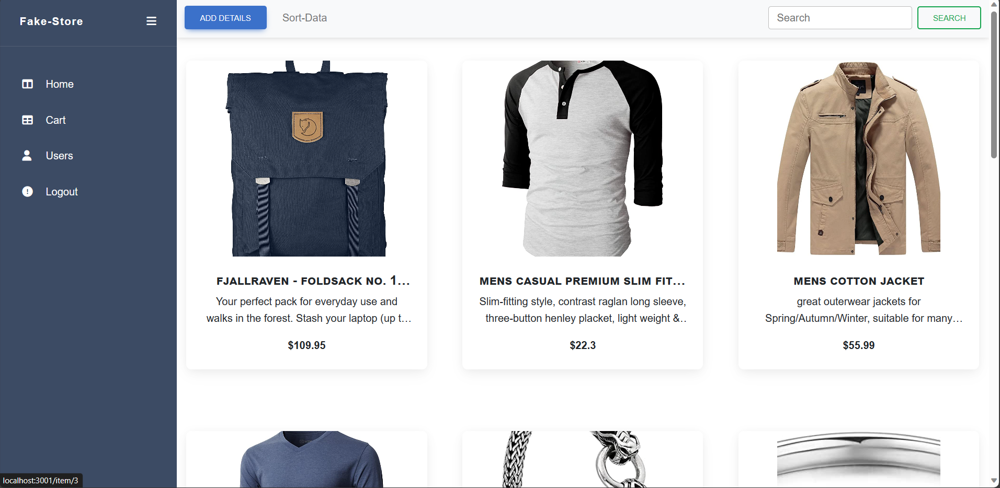
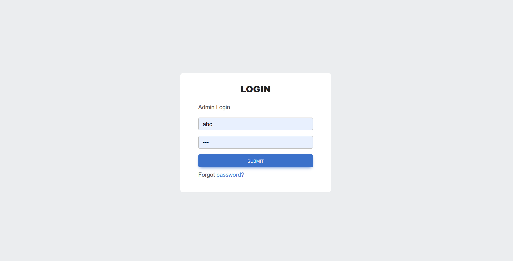
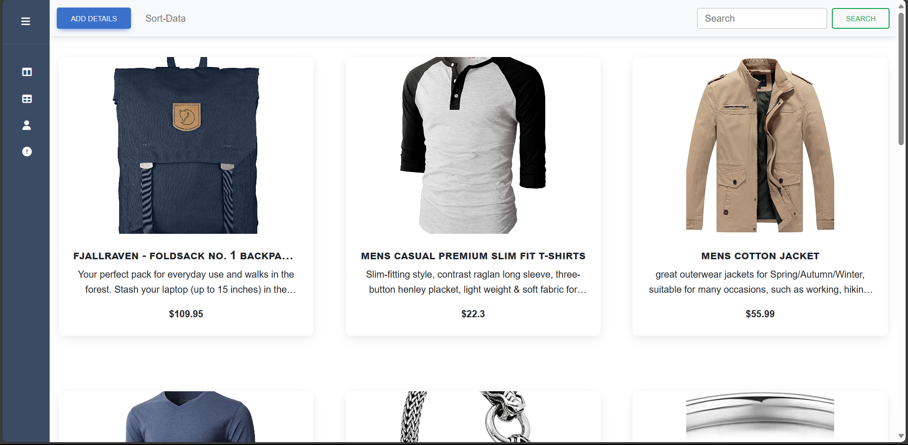
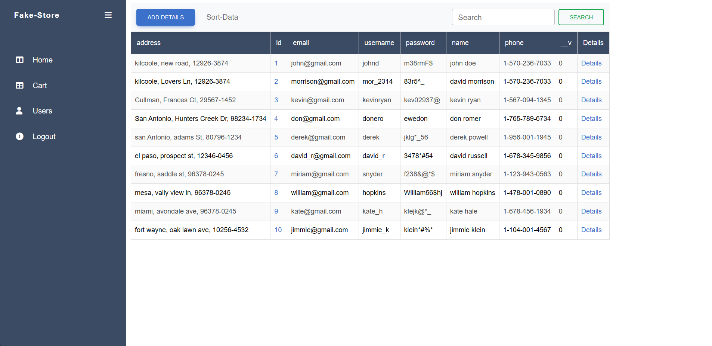

Here's a README for your Data Management System using React.js and the FakeStore API:

# Data Management System using React.js and FakeStore API



## Description

This project is a Data Management System (DMS) built with React.js and utilizes the FakeStore API to manage and display data related to products, users, and a shopping cart. It includes various features like user authentication, data validation, CRUD operations, and a responsive layout.

## Table of Contents

1. [Installation](#installation)
2. [Usage](#usage)
3. [Features](#features)
4. [Screenshots](#screenshots)
5. [Contributing](#contributing)
6. [License](#license)
7. [Acknowledgments](#acknowledgments)

## Installation

To get started with the project, follow these steps:

1. Clone the repository to your local machine.

   ```bash
   git clone https://github.com/your-username/dms-project.git
   ```

2. Navigate to the project directory.

   ```bash
   cd dms-project
   ```

3. Install project dependencies.

   ```bash
   npm install
   ```

4. Start the development server.
   ```bash
   npm start
   ```

Your project should now be running locally. You can access it in your web browser at `http://localhost:3000`.

## Usage

### Login and Home Page

- Start by logging in with the provided static data. Upon successful login, you'll be directed to the Home page.



- The project uses React Bootstrap for styling, ensuring a responsive layout.
- The sidebar includes four items: HOME, CART, USER, LOGOUT.

### Home Page

- The Home page features a navbar with three options: ADD DETAILS, SORT DATA, SEARCH. Currently, only ADD DETAILS is functional.
- Clicking on ADD DETAILS reveals a form with Yup validations for fields like Title, Price, Description, Category, and Image Link.
- Upon successful validation, data is added to `https://fakestoreapi.com/products`.



- Data is fetched and displayed in a paginated manner from `https://fakestoreapi.com/products`, with 10 entries per page.
- Product details can be viewed, added to the cart, edited, or deleted.
- Editing a product displays a form with the same Yup validations.

### Users

- The Users page shares the same navbar with ADD DETAILS, SORT, and SEARCH options (ADD DETAILS is the only functional one).
- User data is fetched from `https://fakestoreapi.com/users`.



- The ADD DETAILS form includes Yup validations for fields such as Address, Email, Username, Password, Name, Phone, and Website.

### Cart

- The Cart page doesn't have an ADD DETAILS feature; items are added from the product page.
- Cart data is displayed in a tabular format.

### Logout

- Clicking the LOGOUT option redirects you to the login page.

## Features

- User authentication with a login page.
- Form validation using React Hook Forms and Yup.
- CRUD operations for product and user data.
- Redux store for state management.
- Axios for fetching data from the FakeStore API.
- Responsive design with React Bootstrap.
- Toast library for pop-up notifications.
- Loading indicators to improve user experience during data fetching.

## Screenshots

You can find project screenshots in the [screenshots](screenshots/) directory.

## Contributing

If you want to contribute to this project, please follow the guidelines in the [CONTRIBUTING.md](CONTRIBUTING.md) file.

## License

This project is licensed under the [MIT License](LICENSE).

## Acknowledgments

We would like to thank the developers of React.js, Redux, React Bootstrap, Axios, and Yup for their valuable tools and libraries used in this project. Additionally, we acknowledge the open-source community for their contributions to the software development ecosystem.
